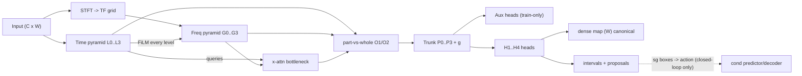

# TF-Scout v2 — Loss Plan & Finalized Architecture (grill-closed)

**Status:** finalized after grill rounds 1–2 (2026-09-03). Extends `DESIGN_TSAD_DUALSTREAM.md` v1 (which left loss/framework open, §9) with a committed loss-per-branch plan, head/criterion class layout, and the action-conditioned variant. **No implementation yet.** Vocabulary follows `CONTEXT.md`. Evaluation posture inherited from v1 D1/D14 (normal-only training, train-only quantile thresholds, honest vs PA split, mandatory no-training baseline).

**Grill resolutions:**
- Q1/Q1' → tournament-style: run **all** arms open-loop baseline + closed-loop action-conditioned variant (owner proposition). Staged: open-loop first, closed-loop second.
- Q2 → time pathway as focus module: two separate aux heads (`ReconAuxHead`, `BoxAuxHead`) + `CombinedAuxCriterion`, each runnable alone.
- Q3 → all four H-families get own Head + Loss classes; owner runs tournament. H1 + H4 are primaries, H2/H3 are fused channels + baselines.
- Q4 → KL: try per-token view-KL (C, DCdetector-style) with variance guard; fallback to window-VAE ELBO (A). Per-level tiny VAEs only with annealing + free-bits.
- Q5 → **always per-machine training** (SMD official protocol). H4 default: per-machine single COCA-style center + variance; DAGMM K=2–4 as variant.
- Q6 → **drop forecasting.** Horizons `k` become masked-part indices (I-JEPA style). Reconstruction only, shape-aware inside proposed parts.
- Q7 → (a) dense per-timestep score map canonical (frozen `metrics/**` seam); interval detections secondary + proposal masks for part-reconstruction.

## 1. What changed vs v1

| # | v1 position | v2 decision |
|---|-------------|-------------|
| D17 | Loss/framework open, tournament protocol only (§9) | Committed per-branch loss table (§4) + class layout (§5), tournament kept as selection method |
| D18 | Time pathway = scout (localization carrier) | Time pathway = scout **+ focus module**: two training-only aux heads steer it, pruned at inference |
| D19 | Predictor = causal future-latent forecaster (JEPA-line reuse) | Predictor = masked-part latent predictor (no future); decoder = part-reconstructor. Forecasting dropped |
| D20 | No projector / decoder in trunk | Disposable `Projector(MLP+BN)` before SIGReg (LeWM requirement) + lightweight per-level decoders (training + H2 scoring) |
| D21 | No action slot | Action slot added: `sg(YOLO boxes) → ActionEmbed → AdaLN/concat` into predictor/decoder (closed-loop variant only) |
| D22 | Single combined loss per tactic | One Head + one Loss class per family; `Combined*Criterion` wrappers for ablations (Q2/Q3) |
| D23 | Corpus joint/single open (JEPA-line D9) | Per-machine only for headlines; joint corpus exploratory at most |
| D24 | `2010.08354` cited loosely as "DTW loss" | Corrected: `2010.08354` = Blondel Soft-DTW **divergence** (AISTATS 21); DILATE shape+temporal = `1909.09020`. Both in plan, different roles |

## 2. Trunk (fixed during tournament)

Default: **F2 (STFT TF-grid) + P2 (dual pyramids + FPN) + S3 (FiLM every level + cross-attention bottleneck)** per v1 D5–D7. Time pathway conv-pyramid `L0…L3` (strides 1,2,4,8); frequency pathway `G0…G3` on TF grid (`n_fft=64, hop=16` running example, W=512). Steering time→frequency one-directional. Part-vs-whole comparator emits O1 (cross-scale prediction) + O2 (feature comparison) mismatch maps on all three axes (part↔global, fine↔coarse, part↔part). Fused maps `P0…P3` + context `g` = trunk output. All heads attach here.



## 3. LeWM mapping (correction + adoption)

LeWM (`2603.19312`): `MSE(next_emb) + 0.1·SIGReg(emb)` per step, disposable `[CLS]→MLP+BN` projector, predictor ~2× encoder with per-layer zero-init AdaLN action injection. **No EMA/stop-grad** — SIGReg replaces them. EMA belongs to V-JEPA (`ema 0.99925` constant, layer-normed targets).

Adopted here:
- **Projector:** disposable `Linear→BN→GELU→Linear` on online latents, SIGReg sees projected tokens only, projector discarded for scoring (LeNEPA `2607.00958` pattern).
- **Anti-collapse arms (one per run, never stacked naively):** (a) SIGReg `λ=0.1` primary; (b) EMA teacher `m=0.99925` + layer-norm targets; (c) soft codebook fallback. SIGReg projections never enter score path.
- **Predictor:** masked-part predictor (TCN/GRU kept as class, horizons reinterpreted as part offsets), causal within window.
- **Decoder (new):** lightweight per-level upsamplers `(D_l,T_l)→(C,W)` for part-reconstruction + H2 scoring. No phase-recovery inside trunk; iFFT head keeps phase-reuse trick (`DESIGN_TSAD_DUALSTREAM §8.3`).
- **Action (closed-loop variant only):** `ActionEmbed(obj, center, length)` → AdaLN scale/shift (or concat if AdaLN ablated). Proposals **detached** (`sg`) to break circularity. Precedent: cardiac AC-JEPA `2604.22618`, AC-MTM `2608.17542` (training-only dynamics head beats SIGReg 80% vs 58%).

Open-loop vs closed-loop:
- **Open-loop (baseline, tournament-safe):** YOLO proposes → masks select parts → predictor/decoder reconstruct unconditionally. No feedback. Trunk fixed per v1 D14.
- **Closed-loop (owner proposition, variant arm):** `sg(proposals) → action → conditional predict/reconstruct proposed parts`. Requires separate optimizer step or alternating schedule + `cos(g_main,g_aux)` monitoring (PCGrad fallback). Must beat open-loop + no-training baseline on honest metrics to promote.

## 4. Loss-per-branch table (committed)

| Branch | Loss | Formula / intuition | Collapse / risk guard |
|--------|------|---------------------|-----------------------|
| Trunk regularizer | SIGReg (LeJEPA `2511.08544`) | sketched Epps-Pulley to isotropic Gaussian, `λ=0.1`, on projected tokens | single hyperparam; BN in projector mandatory |
| O2 channel | View-KL (C): `0.5KL(P‖sg(N))+0.5KL(N‖sg(P))` (DCdetector `2306.10347`) | same timestamp in two contexts → same embedding; anomaly = disagreement | stop-grad asymmetry + COCA variance hinge; no decoder needed |
| H2-VAE fallback | ELBO (A): `−E[log p(x‖z)] + β·KL(q‖N(0,I))` (OmniAnomaly/InterFusion family) | per-window recon-probability + smooth normal manifold | KL annealing, β<1 early, free-bits, flows; fallback if per-token VAE collapses |
| H2 recon | `MSE + λ_shape·Soft-DTW-divergence-γ` (`2010.08354`) on **proposed parts only** | MSE catches spikes, Soft-DTW catches morphology under shift; divergence (not raw Soft-DTW) is non-negative + minimized iff equal | `O(k²)` on parts only, γ≈1e-2 with log-sum-exp; DILATE-temporal `⟨A*,Ω⟩` (`1909.09020`) as ablation, not default |
| Aux-recon | Lightweight L2 (`CombinedAuxCriterion` member) | forces time pathway to keep fine+global detail; pruned at inference | small bottlenecked decoder; anneal `λ_rec`; detach on conflict |
| Aux-box / H1-det | YOLO-1D: focal-BCE objectness + `1−1D-CIoU` box + DFL, on `SubAnomaly` synthetic boxes only, 1:4 hard mining | learns "time objects" `(center, length)`; doubles as proposal generator | synthetic≠real (T5 risk); dense map stays canonical so box bias can't inflate honest scores |
| H4-metric | COCA-style `invariance(2−sim) + variance-hinge(γ−std)` per-machine center + Deep-SAD inverse `η·(dist+eps)⁻¹` on synthetics | normal tight around center, injected anomalies pushed out | fixed center (init mean, not learned), no-bias nets; DAGMM K=2–4 energy as variant for multi-regime machines; reject DEC balanced-cluster prior |
| H3-energy | Margin-ranked scalar energy (Deep SVDD/DevNet family) | normal low energy + margin; score = energy | needs synthetic negatives for margin; tournament-only |
| T6 consistency | TF-C style `L_T + L_F + L_C` (time↔frequency agreement) | violation = score channel | stop-grad/regularizer against trivial consistency; variant only |

Rejected: full-window forecasting (Q6); global cross-machine center (Q5); raw Soft-DTW as loss (biased, can be negative — use divergence); Anomaly-Transformer minimax assoc-discrepancy as default (λ/window-sensitive, PA-inflated in paper; keep as variant).

## 5. Class layout (Q2/Q3: separate + combinable)

```
heads/
  ReconAuxHead        # lightweight decoder g(h) -> x_hat (train-only)
  BoxAuxHead          # YOLO-1D: obj + center + length (+type logit opt)
  H1DetectHead        # dense logit + interval grid sharing BoxAuxHead geometry
  H2ReconHead         # time decoder + iFFT spectral head (phase-reuse) + opt per-level tiny VAE (mu/logvar)
  H3EnergyHead        # scalar energy per position
  H4MetricHead        # embed -> dist-to-center map (+ SAD push term)
losses/
  ReconAuxLoss        # MSE (+ opt Soft-DTW-divergence on parts)
  BoxAuxLoss          # focal-BCE + 1D-CIoU + DFL
  CombinedAuxCriterion# L = L_rec + λ_box·L_box; flags run either alone
  H1Loss / H2Loss / H3Loss / H4Loss   # one per family
  CombinedHeadCriterion # weighted sum with uncertainty/GradNorm weighting; PCGrad on cos<0
  ViewKLLoss          # O2 symmetric KL channel
  SigRegLoss          # existing, on projected tokens (existing file extended with projector)
models/
  Projector           # disposable MLP+BN (LeWM requirement, new)
  ActionEmbed         # box -> action vector (closed-loop only, new)
  CondPredictor       # AdaLN-injected predictor wrapper (closed-loop only, new)
```

Each Head runnable alone; each Loss runnable alone; `Combined*` only sums. Scoring: per-level `repeat_interleave(s_l)` → weighted-sum → `(W,)` dense map → cover-count-aware window aggregation (existing `Scorer` pattern). Boxes via time-axis NMS; boxes also emit part-masks for `H2Loss`.

## 6. Tournament protocol (all architectures + owner proposition)

Fixed trunk (§2), one tactic swapped at a time. Normal-only training, **per-machine always**. Thresholds = clean-train quantiles (0.995 default), never test labels/stats. Headline = honest point AUROC/AP, window AUROC/AP, F1 w/o PA, MCC (+VUS/affiliation free from frozen stack); PA column separate for comparability. Mandatory no-training baseline per tactic. Promotion: beats no-train by clear margin + non-trivial probe-separation fusion weight + survives honest protocol + acceptable per-machine variance. Order: (1) open-loop H1/H4 + aux; (2) KL C vs A; (3) geometry COCA vs DAGMM; (4) shape-loss γ/λ ablations; (5) closed-loop action-conditioned vs open-loop winner.

## 7. Budgets / hygiene

~10⁵–10⁶ params soft cap; single-GPU bf16 AMP train, fp32 score, eval-mode validation stats (LeWM BatchNorm 300× lesson). CPU-plausible inference. Contamination robustness = post-hoc ablation, not blocker.

## 8. Bibliography (primary IDs used)

LeWM `2603.19312`; LeJEPA `2511.08544`; V-JEPA 2.1 `2603.14482`; Asleep-at-the-Wheel `2608.01336`; repro `2608.10145`; AC-MTM `2608.17542`; cardiac AC-JEPA `2604.22618`; LeNEPA `2607.00958`; TS-JEPA `2509.25449`; Soft-DTW `1703.01541`; Soft-DTW divergence `2010.08354`; DILATE `1909.09020`; Anomaly Transformer `2110.02642`; DCdetector `2306.10347`; TS2Vec `2106.10466`; COCA `2207.01472`; CARLA `2308.09296`; Deep SAD `1906.02694`; Deep SVDD PMLR v80 ruff18a; FiLM `1709.07871`; YOLO (Redmon 2016); FPN (Lin 2017). Repo docs: `DESIGN_TSAD_DUALSTREAM.md`, `DESIGN_TSAD_JEPA.md`, `RESEARCH_TS_AD_HEADS.md`, `RESEARCH_LEWORLDMODEL.md`, `RESEARCH_FOURIER_TS_DL.md`, `RESEARCH_CROSS_STREAM_CONDITIONING.md`.
