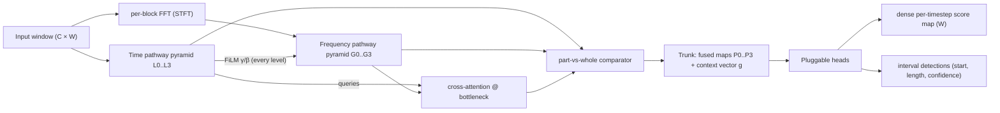
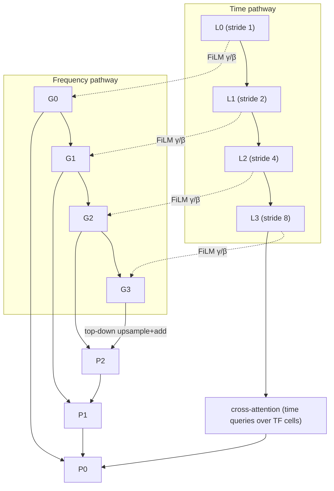
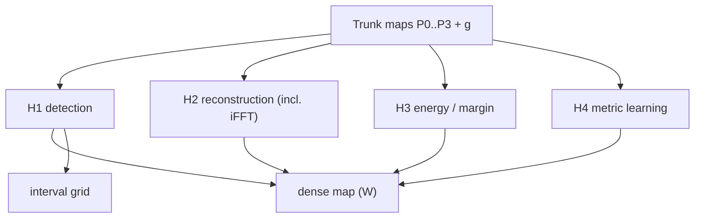

# TF-Scout — Dual-Stream Time×Frequency Architecture for Time-Series Anomaly Detection

**Status:** design document, v1 (2026-09-01). **No implementation committed.** This is a
standalone architecture specification produced by a grilling session; it does not wire
into this repo's stages, registries, or configs. It deliberately leaves the loss and the
learning framework open — §9 defines a tournament protocol for checking loss tactics
instead of committing to one.

## 0. What this document is

The repo's main line is a convolutional-pyramid JEPA (`DESIGN_TSAD_JEPA.md`). This
document specifies a **novel sibling architecture**, nicknamed **TF-Scout**: the time
pathway *scouts* (locates and directs), and the frequency pathway *searches* (spectral
detail where the scout pointed). The design is documented as an explicit design space:
for every module — feature extractor, steering, bottleneck, head — the competing
architectures are written side by side with exact shapes, trade-offs, small illustrative
PyTorch snippets, and a marked default. Vocabulary is canonicalised in `CONTEXT.md`.

## 1. Decision ledger

| ID | Decision | Rationale / where argued |
|----|----------|--------------------------|
| D1 | Standalone design doc; the repo's evaluation *posture* (train-only thresholds, honest vs point-adjust separation, no-training baseline) is retained as protocol | §11 |
| D2 | Normal-only training regime; contamination robustness is a documented ablation, not a requirement | §9.2 |
| D3 | Dual-stream: time pathway primary for localization, frequency pathway for spectral structure | §4, bibliography §13 |
| D4 | Steering is soft and one-directional: time → frequency | §6 |
| D5 | Steering mechanisms S1 (FiLM), S2 (cross-attention), S3 (both) documented; default S3 | §6.1–6.3 |
| D6 | Frequency representation options F1–F4 documented; default F2 (per-block FFT grid / STFT) | §5.2 |
| D7 | Pyramid topology options P1 (time-only pyramid) and P2 (dual pyramids + FPN fusion) documented; default P2 | §5.3 |
| D8 | Part-vs-whole comparison fixed to three axes (part↔global, fine↔coarse, part↔part); operators O1 (cross-scale prediction) and O2 (feature comparison) documented; both emit mismatch maps | §7 |
| D9 | Canonical outputs: dense per-timestep score map AND YOLO-style interval detections; dense map is the evaluation-canonical format | §8.1 |
| D10 | Heads pluggable across four families (detection, reconstruction, energy, metric-learning); no loss/framework committed | §8, §9 |
| D11 | Inverse FFT lives only inside the reconstruction head (phase-reuse trick); the trunk stays latent | §8.3 |
| D12 | Soft compute budget: order 10⁵–10⁶ parameters, single-GPU training, no very large models | §10 |
| D13 | Window length is parameterized; running example SMD, C=38, W=512 (chosen over 256 for frequency-bin resolution) | §3 |
| D14 | Tournament protocol: fixed trunk, one tactic swapped at a time, train-only thresholds (quantile 0.995), honest + PA reported separately, mandatory no-training baseline | §9.2 |
| D15 | Headline novelty claim: the full-stack dual-stream architecture, with time→frequency steering and part-vs-whole comparison as the named mechanisms | §2 |
| D16 | Learned frequency filterbanks are a deferred variant (F5), not part of the documented options | §5.2 |

## 2. Design goals and the claim

**G1 — Localize.** The model must say *where* inside a window something became strange,
at sub-window granularity. (The repo's rebuild spec shows a window-level detector being
replaced for exactly this reason — `specs/jepa-tsad-rebuild.md`.)

**G2 — See spectra.** The model must exploit frequency-domain fine detail. The repo's
own Fourier lessons record the structural argument: the magnitude spectrum of the whole
window is blind to *where* a spike happened (position lives in phase), while the time
domain is blind to period structure. Neither domain alone is sufficient
(`lessons/0001–0003`, `RESEARCH_FOURIER_TS_DL.md`).

**G3 — Steer.** Time-domain evidence must direct the frequency analysis — the
architecture's headline mechanism. The attention/ modulation weights are an
interpretability artifact: a map of *where the frequency pathway searched*.

**G4 — Compare part to whole.** Replicate the human checking pattern: sub-segments are
evaluated against the whole input, against each other, and against coarse-scale summaries
of themselves. Anomalies are relative.

**G5 — Evaluate honestly.** Train-only thresholds, point-adjust reported only for
literature comparability, mandatory no-training baseline. These are inherited from the
repo's evaluation posture (`REFERENCE_NUMBERS.md` lists how PA + test-tuned thresholds
inflate published bars).

**Claim (D15):** a full-stack dual-stream time×frequency detector in which (a) the time
pathway steers the frequency pathway and (b) part-vs-whole comparisons at multiple
resolutions produce per-position mismatch maps usable as anomaly scores. The
bibliography (§13) supports the claim's open space: the verified pattern in the
literature is "route structure discovery through frequency, keep supervision and
localization in time" (`RESEARCH_FOURIER_TS_DL.md` §4); inverting part of that loop —
time telling frequency where to search — is the unoccupied niche, alongside the
documented gap of explicit sub-window scoring (`RESEARCH_LEWORLDMODEL.md` §5).

## 3. Notation and running example

| Symbol | Meaning | Running example |
|------|---------|-----------------|
| `x` | input window | `(B, C, W)` |
| `C` | channels | 38 (SMD) |
| `W` | window length | 512 |
| `B_f` | FFT block (n_fft) | 64 |
| `H_f` | FFT hop | 16 |
| `T'` | TF-grid frames | ⌈W/H_f⌉+1 ≈ 33 |
| `F` | frequency bins | B_f/2+1 = 33 |
| `s_l` | pyramid stride at level l | 1, 2, 4, 8 |
| `D_l` | channels at level l | 32, 32, 64, 96 (proven sizes) |

Time levels `L0…L3` with strides (1,2,4,8) follow the proven `PyramidEncoder` pattern
(`models/jepa_pyramid.py`); frequency levels `G0…G3` live on the TF grid. Window 512 is
the default (D13): 256 would give only ~16 frames at hop 16, which starves the time
axis of the TF grid. Both remain arm-level choices, not embedded assumptions.

## 4. Architecture overview



End-to-end data flow:

1. A window `(C, W)` enters both pathways.
2. The **time pathway** downsamples by conv pyramid into latent maps `L0…L3`
   (sub-windows of 1/2/4/8 input steps — the same granularity ladder the repo's JEPA
   line uses).
3. The **frequency pathway** first builds the TF grid `(T', F)` (F2 default, §5.2),
   then convolves over it, optionally as a pyramid `G0…G3`.
4. **Steering** (§6): time features modulate frequency features (FiLM at every level;
   cross-attention at the bottleneck). This is the "where to search" mechanism.
5. **Part-vs-whole** (§7): mismatch maps are computed along three axes and across the
   aligned pyramid levels.
6. **Trunk** = fused post-fusion maps `P0…P3` (FPN style, P2 default) plus a global
   context vector `g` pooled from the coarsest map.
7. **Heads** (§8) map trunk outputs to per-timestep scores and/or interval boxes; per
   level a token maps back to input timesteps by `repeat_interleave(s_l)`, and
   overlapping windows are aggregated cover-count-aware — the same seam shape as the
   repo's `Scorer` (`utils/scoring.py`), kept here as a *pattern*, not a dependency.

## 5. Feature extractor

### 5.1 Time pathway (fixed, proven pattern)

Strided-conv pyramid: k=7 stem (stride 1), then per level a stride-2 downsample block
followed by a stride-1 refine block (`Conv→BatchNorm→GELU→Dropout`). Rationale:
locality, weight sharing, small-kernel CPU friendliness, and a working default in this
repo. A transformer encoder over patches is kept only as a capacity-comparison arm —
the repo's JT arm exists for exactly that purpose (`DESIGN_TSAD_JEPA.md` §2), and the
same posture is adopted here.

### 5.2 Frequency representation — F1, F2, F3, F4 (+F5 deferred)

**F1 — global FFT + 1D convs.** One `rfft` over the whole window per channel → a
frequency vector `(B, C, F_big)`. Convs slide along the frequency axis.

- Sees: global periodicity, dominant periods (TimesNet-style period discovery).
- Blind to: *where* anything happens — position information lives in the phase and is
  in practice discarded when magnitude is used; the repo's lessons flag exactly this.
- Steering cannot point at time regions — there is no time axis to point at.

```python
# F1 — one spectrum per channel
X = torch.fft.rfft(x, dim=-1)                 # (B, C, F_big)
feat = X.abs().log1p()                        # magnitude only; position lost
```

**F2 — per-block FFT grid (STFT) + 2D convs. ← default (D6).** The window is split into
overlapping blocks, each block FFTed; result is a TF grid `(T', F)` retaining both axes.

- Sees: local spectra with time stamps — broken periodicity *located in time*,
  spike→broadband signatures *at their position* (the spike/broadband and
  periodic/narrowband duality, recorded in the repo's lessons and in
  `RESEARCH_CROSS_STREAM_CONDITIONING.md` §5).
- Steering gets a grid of cells to point at — required for G3.
- This is the tokenization TimeVQVAE-AD uses for STFT tokens, and the feature surface
  CATCH patches into frequency bands (`RESEARCH_FOURIER_TS_DL.md` §4).

```python
# F2 — TF grid with magnitude + phase (phase kept, unlike F1)
X = torch.stft(x, n_fft=64, hop_length=16, win_length=64,
               return_complex=True)            # (B, C, T', F) complex
mag, ph = X.abs(), X.angle()
feat = torch.stack([mag.log1p(), ph.cos(), ph.sin()], dim=2)  # (B, C, 3, T', F)
feat = feat.flatten(1, 2)                     # (B, 3C, T', F) -> 2D conv stack
```

**F3 — multi-resolution FFT bank.** Two/three block sizes in parallel, e.g.
n_fft ∈ {32, 64, 128} with hops {8, 16, 32} chosen so `T'` aligns across branches.
Short blocks = fine time / coarse frequency; long blocks = coarse time / fine
frequency.

- Sees: all of F2 at multiple time–frequency trade-offs simultaneously.
- Costs: one branch per block size; alignment hyperparameters; heavier than F2 whose
  convolutional pyramid already provides multi-resolution *on* the TF grid. Listed for
  completeness; F2 + FPN (P2) is the recommended way to get "multiple resolutions".

**F4 — global + per-block hybrid.** A global spectrum (F1) pooled into a summary vector
plus the F2 grid for localized detail. Two encoders to fuse; the global stream mainly
adds period identification. Documented as an option; default remains F2.

**F5 — learned filterbank (deferred, D16).** A learned time→frequency front-end
(learned FIR-like convs, or FFT + learned complex mixing as in FITS/FreTS). More
novel-looking, harder to debug and to defend at review; deferred until F2 is baselined.
(`RESEARCH_FOURIER_TS_DL.md` catalogs the complex-coefficient-learning family.)

> **Per-channel note:** the FFT is computed per channel; cross-channel mixing happens in
> the convolutions, not in the transform. This keeps the transform invertible-per-channel
> (relevant for the iFFT head, §8.3).

### 5.3 Pyramid topology — P1 vs P2

**P1 — time-only pyramid.** The time pathway carries the full `L0…L3` pyramid; the
frequency pathway is processed at a single scale; the two meet once, at the bottleneck.
Cheapest fusion; but all steering then happens at one place — and conditioning fed only
at the input gets washed away by normalization (SPADE lesson, per
`RESEARCH_CROSS_STREAM_CONDITIONING.md` §2).

**P2 — dual pyramids + FPN fusion. ← default (D7).** Both pathways build pyramids;
lateral connections join matched scales and a top-down path upsamples-and-adds (the
YOLO/FPN pattern — YOLO's neck is the user's cited inspiration; FPN = Lin et al. 2017).
Steering is injected at *every* level.



`P0…P3` are the trunk's fused maps. Lateral joins are 1×1 convs to a common channel
width; top-down path is nearest upsample + add, FPN-canonical.

## 6. Steering (time → frequency)

One-directional by decision (D4): the headline claim is that *time tells frequency
where to search*. Bidirectional variants are ablations, not defaults.

### 6.1 S1 — FiLM-style modulation

Per level, time features produce a per-channel scale and shift that modulate frequency
features (`FiLM`, Perez et al. 2018, per `RESEARCH_CROSS_STREAM_CONDITIONING.md` §2):

- The FiLM ablation (same source) reports conditioning carried mainly by **γ** (scale);
  replacing γ with a constant drops accuracy sharply — so γ is mandatory, β optional.
- Injection must happen **at every level**, because conditioning fed only at the input
  is washed away by normalization (SPADE lesson).

```python
# S1 — FiLM: h_t (B, Dt, T_l) modulates h_f (B, Df, T', F)
gb = film_mlp(h_t.mean(dim=2))                # pool time -> (B, 2·Df)
gamma, beta = gb.chunk(2, dim=1)
h_f = (1 + gamma)[:, :, None, None] * h_f + beta[:, :, None, None]
```

### 6.2 S2 — cross-attention (the explicit "where to search" map)

Time tokens are queries; TF-grid cells are keys/values. The attention matrix is itself
the explainability artifact (G3): for each time position, the distribution over *which
time×frequency cells* the frequency pathway looked at. TFiLM (an RNN stream modulating
a conv stream on 1D data) is the closest sequence precedent; TFAD runs parallel time/
frequency TCN branches without steering — the gap S2 fills.

```python
# S2 — queries: (B, T_l, D); keys/values: flattened TF cells (B, T'·F, D)
attn = softmax(q @ k.T / sqrt(D), dim=-1)      # (B, T_l, T'·F) — the search map
steered = attn @ v                             # (B, T_l, D)
```

### 6.3 S3 — combined ← default (D5)

FiLM at every level (cheap, always on) + cross-attention once at the bottleneck, where
the TF grid is coarsest and the attention is affordable. S1-only and S2-only remain
documented arms; "no steering" and "reversed steering (freq→time)" are the negative
ablations.

## 7. Bottleneck — the part-vs-whole comparator

### 7.1 The three axes (D8)

1. **part ↔ global** — each position against a global context vector `g` pooled
   (attention-pool, not mean-pool) from the coarsest trunk map: "does this part fit the
   window's overall pattern?"
2. **fine ↔ coarse** — coarse maps upsampled and compared against fine maps over the
   same time range: "do the scales agree here?" (TS2Vec-flavored hierarchical
   consistency, but kept map-level.)
3. **part ↔ part** — each position against the within-window neighborhood of other
   positions (leave-one-out local context): "is this segment like the others in this
   same input?"

### 7.2 O1 — cross-scale prediction operator

A small predictor network maps coarse (or global) features to fine features; mismatch =
prediction error map. This is the operator the repo already runs (`CausalTCNPredictor`
in `models/jepa_pyramid.py`), re-used here as one comparator among two. Predictive
operators can be trained; that is a virtue (learnable) and a risk (the predictor may
explain anomalies away — see §9.1 T1).

### 7.3 O2 — vector/feature comparison operator

Direct comparison — negative cosine similarity or L1 — between features at matched
positions. Parameter-free, cannot learn to "explain away", but fixes the geometry.

```python
# O2 — part ↔ global: per-position mismatch map (kept as a map, not pooled)
m_pg = 1 - F.cosine_similarity(h, g[:, :, None], dim=1)  # (B, T) -> score channel
```

Operators O1 and O2 are both specified; each axis (§7.1) is computed with each operator,
and every resulting **mismatch map** becomes a named score channel the head layer can
fuse — mirroring the repo's `channels` concept (`Scorer.score_series`) as a pattern.

### 7.4 Bottleneck fusion variants

Options: (a) concat + 1×1 convolution over the aligned maps (simplest); (b) the
cross-attention bottleneck (S2 doubles as fusion); (c) context-vector + broadcast
(enables axis 1). Default: concat + 1×1 after FPN, with `g` pooled from `P3` for the
part↔global axis. Fusion placement is a documented choice, not an assumption.

## 8. Heads

### 8.1 Output formats (D9)

**Dense map adapter (evaluation-canonical).** Per level, 1×1 convs produce score maps;
maps are upsampled to input resolution (`repeat_interleave(s_l)`), weighted-summed
across levels/channels → `(W,)` per-timestep scores; overlapping windows aggregated
cover-count-aware; uncovered tails forward-filled. This emits exactly the
`(scores, start_idxs, end_idxs)` seam the frozen metrics stack consumes
(`metrics/**` untouched — D1).

**Interval head (YOLO-1D).** The time axis is divided into `G` grid cells; each cell
predicts *objectness* plus a segment: center-offset and length (and optionally a type
logit). Non-maximum suppression runs along the time axis. YOLO formalism (Redmon et al.
2016) transplanted to 1D, matching how the user's detector intuition reads anomalies as
"time objects".

```python
# interval head — per grid cell: objectness + (center, length)
out = interval_head(trunk_map)                 # (B, G, 3+types)
obj, center, length = out[..., 0].sigmoid(), out[..., 1], out[..., 2].exp()
```



### 8.2 H1 — detection / classification head

Per-position logits (dense) and/or objectness boxes (interval). Supervision normally
requires negatives; under the normal-only regime (D2), negatives come from synthetic
injection — the repo's `SubAnomaly` machinery (`data/augment.py`) is the reference
implementation pattern, currently used there for calibration probes only. Risk: the
synthetic anomaly distribution ≠ real anomalies (T5, §9.1).

### 8.3 H2 — reconstruction heads

**Time decoder:** upsample trunk maps back to `(C, W)`; score = per-timestep residual.

**iFFT spectral head (D11):** the one place the inverse transform is allowed. The trunk
re-estimates a spectral saliency (e.g., spectral residual: log-magnitude minus its
local average along frequency, the Microsoft SR-CNN move — KDD 2019, production KPI
F1 0.798→0.811 per `RESEARCH_FOURIER_TS_DL.md`), then inverts with the **input's
phase reused**:

```python
# iFFT head — magnitude edited, input phase reused, time residual as score
X = torch.stft(x, n_fft=64, hop_length=16, return_complex=True)
logmag = X.abs().log1p()
resid = logmag - avg_pool1d_along_freq(logmag)
X_hat = resid.exp() * torch.exp(torch.angle(X))                # keep input phase
x_hat = torch.istft(X_hat, n_fft=64, hop_length=16, length=W)
score_map = (x - x_hat).abs().mean(dim=1)                      # (B, W)
```

Phase-reuse avoids the phase-recovery problem (Griffin–Lim-style iteration would be
infeasible inside a training loop). Reconstruction families have a known failure mode —
the decoder generalizes to anomalies it never saw — which the tournament must test
(§9.1 T2); the FITS SMAP/MSL result (frequency-only far behind on event data,
70.74 vs 96.69 FID-adjusted numbers per the repo's Fourier survey) motivates keeping
iFFT as a *head option*, not the trunk.

### 8.4 H3 — energy / margin head

A scalar energy per position from trunk features; training arranges normal positions at
low energy with a margin; the inference score is the energy. This connects to LeCun's
energy view of JEPA ("the energy is the prediction error" — LeCun 2022, per
`RESEARCH_JEPA_WORLD_MODELS.md`) and to Deep-SVDD/DevNet-style boundary scores
(`RESEARCH_TS_AD_HEADS.md` family H). With no negatives, margin targets come from
synthetic injection or from the mismatch map ranks themselves.

### 8.5 H4 — metric-learning head ("the face-recognition idea")

Normal patterns form identities; an anomaly is an *unknown identity*, exactly as face
verification treats a face as "faceA vs faceB" without semantic classes. Two readings,
both documented:

- **Segment-identity clustering (no bank):** windows/patches are embedded; identities
  arise from augmentation-invariance or regime prototypes; score = per-position distance
  to the normal identity set (margin / arc-margin families).
- **Contrast with memory:** a bank of past normal patterns (PatchCore-flavored) is
  explicitly *demoted* — it was on the menu and deliberately not chosen ( grilling
  round 1, Q4). Documented here only as a variant, since it changes the paper's
  category from architecture to memory method.

Score-to-timestep mapping: per-position trunk embeddings → distance map → dense output.
TS2Vec's masked-view discrepancy and CARLA's triplet pretext are the neighbouring
protocols (`RESEARCH_TS_AD_HEADS.md`, `WORKFLOW_PRETEXT.md`).

### 8.6 Head × output-format compatibility

| Head family | dense map | interval grid | Notes |
|-------------|-----------|---------------|-------|
| H1 detection | ✔ | ✔ | objectness ↔ per-position logit |
| H2 reconstruction | ✔ | (aggregate residual per cell) | iFFT head = dense only |
| H3 energy | ✔ | (energy per cell) | margin training |
| H4 metric | ✔ | — | embeddings pool awkwardly into boxes |

## 9. Loss tactics — how to check them (no commitment, D10/D14)

### 9.1 Tactic axes T1–T6

| Tactic | Training signal | Inference score | Evidence in bibliography | Principal risk |
|--------|-----------------|-----------------|--------------------------|----------------|
| **T1 dense latent prediction** | predict latents (all tokens, all levels, horizons k) | per-position prediction error | repo's own JEPA line; V-JEPA 2.1 dense-loss makes per-sub-window errors well-defined (`RESEARCH_LEWORLDMODEL.md`) | prediction error alone hit chance-level under fair protocols (Asleep-at-the-Wheel, per `RESEARCH_JEPA_WORLD_MODELS.md`) → always fuse ≥2 channels |
| **T2 reconstruction** | decode time signal / spectral residual | residual map | SR-CNN production gain; USAD/OmniAnomaly family (`RESEARCH_TS_AD_HEADS.md`); FITS-experienced failure on event data | decoder generalizes to anomalies; frequency-only collapses on non-periodic data |
| **T3 contrastive / metric** | identity margins over normal patterns | distance-to-identity map | TS2Vec discrepancy (train-only mean+4σ thresholds); CARLA triplet (no-PA F1 0.5114, `WORKFLOW_PRETEXT.md`) | augmentation choice dominates; identity leakage trivialises |
| **T4 energy / margin** | margin-ranked scalar energy | energy | LeCun energy view; Deep SVDD / DevNet family | margins need *some* negatives → synthetic injection |
| **T5 synthetic-negative supervision** | classify injected vs clean | per-position logit | repo's `SubAnomaly` probes (calibration use so far); DevNet end-to-end score learner | synthetic ≠ real anomaly distribution |
| **T6 time–frequency consistency** | time and frequency views agree (TF-C style) | consistency violation | TF-C, CoST, FreCT (`RESEARCH_FOURIER_TS_DL.md`) | trivial consistency (collapse) → stop-gradient / regularizers needed |

For each tactic the tournament asks one question: *does this tactic, trained on the
fixed trunk, produce a score channel that (a) separates injected probes from clean
windows and (b) adds power to the fused score beyond the no-training baseline?*

### 9.2 Protocol (D14)

1. **Fixed trunk:** F2 representation + P2 topology + S3 steering + O1/O2 mismatch
   channels, with `g` context. One tactic (head+loss) swapped at a time.
2. **Normal-only** training and calibration (D2). Thresholds = clean-train quantiles
   (0.995), never touching test labels or test statistics. Contamination robustness is
   run afterwards as an ablation axis (D2), not a blocker.
3. **Honest vs PA:** headline = point AUROC/AP, window AUROC/AP, F1 without
   point-adjust, MCC; PA numbers reported in a separate comparability section — same
   split as the repo's `metrics.json`.
4. **No-training baseline mandatory:** a fresh untrained identical trunk passes through
   the identical scoring path; a tactic that cannot separate from it is dead.
5. **Bars:** compare against `REFERENCE_NUMBERS.md` with its own caveat — those bars are
   harvested by web search and must be re-verified against primary PDFs before being
   quoted; conventions across rows are explicitly non-comparable (PA + best-F1-on-test
   inflation, per Kim et al. 2022's critique and the FITS repo's leakage flags).
6. **Evaluation-integrity habit:** TSB-AD (Liu & Paparrizos, NeurIPS 2024) treats VUS-PR
   as most reliable; VUS and affiliation metrics are in the frozen stack, so they cost
   nothing to report.

### 9.3 Decision criteria

A tactic is promoted when it: (a) beats the no-training baseline on honest metrics by a
clear margin; (b) contributes non-trivial fusion weight against the other channels (the
repo's `Calibrator` probe-separation pattern is the reference); (c) survives the honest
protocol (no PA crutch); (d) shows acceptable per-machine variance on SMD's 28 machines
(aggregation caveat noted in `REFERENCE_NUMBERS.md`). A tactic is demoted to "variant"
when any of these fails — exactly the posture the repo applies to its own JEPA arms.

## 10. Budgets and constraints (D12)

- Parameters: order 10⁵–10⁶, soft cap ≈1M; the sibling JEPA line runs ~300K — TF-Scout's
  frequency pathway and steering add to that, not an order of magnitude more.
- Single-GPU (bf16 AMP) training posture; scoring fp32; validation strictly eval-mode —
  the BatchNorm-inflated-validation lesson from the LeWorldModel reproduction is carried
  as a hygiene rule (`RESEARCH_LEWORLDMODEL.md`).
- Inference should stay CPU-plausible (the repo's 3 ms-vs-5 s budget framing); no
  transformer-scale arms as defaults.

## 11. Relationship to the existing JEPA pipeline

None, by decision (D1): this document does not register backbones, predictors, or
criteria, does not add stages, and does not touch `metrics/**`. The following repo
patterns are reused *conceptually* and cited as such: `PyramidEncoder` stride ladder
(§5.1), `Scorer`'s `(scores, start_idxs, end_idxs)` seam and cover-count aggregation
(§8.1), `Calibrator`'s train-only thresholds / probe-separation fusion (§9.2),
`SubAnomaly` injection (§8.2, §9.1 T5). Should a future cutover wire TF-Scout into the
repo, the integration path is: new backbone registry entry (`tfscout`), new criterion
name per tournament winner, same `score` stage, same metrics stack.

## 12. Open questions

- **OQ1** Window length vs frequency resolution: W=512 default; W sweep needed (D13).
- **OQ2** Phase usage: F2 keeps cos/sin phase channels; whether phase channels earn
  their capacity is an ablation.
- **OQ3** Bidirectional steering (freq→time): documented ablation, expected to blur the
  headline claim without obvious gain.
- **OQ4** Contamination-tolerant training: ablation per §9.2 (D2).
- **OQ5** Interval head vs dense map: whether interval NMS adds anything over map
  thresholding under honest metrics.
- **OQ6** F5 learned filterbank: deferred until F2 baseline exists (D16).

## 13. Bibliography and provenance

### 13.1 Repo research documents (read for this design)

- `RESEARCH_FOURIER_TS_DL.md` — six DFT roles in deep TS models; BOTH-modality
  architectures table; "no winner, hybrid best" conclusion; FITS/TimesNet head-to-heads;
  AD-specific frequency works (SR-CNN, TFAD, FCVAE, FreCT, ATF-UAD, TimeVQVAE-AD);
  evaluation-integrity notes (S1–S21 with URLs).
- `RESEARCH_CROSS_STREAM_CONDITIONING.md` — six conditioning families (additive-weight,
  multiplicative-weight, dynamic kernels, feature-wise affine, attention, generated
  weights); FiLM γ ablation; SPADE wash-out lesson; TFiLM; CATCH band analysis;
  ranked mapping to this repo (S1–S26 with URLs).
- `RESEARCH_TS_AD_HEADS.md` — ten head families A–J; marketing-vs-code flags
  (Anomaly Transformer, TS2Vec, ML4ITS, OmniAnomaly, DevNet).
- `RESEARCH_JEPA_WORLD_MODELS.md` / `RESEARCH_LEWORLDMODEL.md` — energy-as-prediction-error;
  Asleep-at-the-Wheel chance-level warning; V-JEPA 2.1 dense loss enabler; sub-window
  scoring gap; LeWM/SIGReg details and BatchNorm lesson.
- `DESIGN_TSAD_JEPA.md` / `DIAGRAM_TSAD_JEPA.md` / `specs/jepa-tsad-rebuild.md` /
  `WORKFLOW_PRETEXT.md` — the sibling line's proven patterns reused conceptually.
- `REFERENCE_NUMBERS.md` — comparison bars + provenance flags + evaluation-caveat
  literature (Kim 2022 PA critique; TSB-AD; VUS; affiliation; Elephant-in-the-Room).
- `lessons/0001–0003` + `reference/0001-dft-cheatsheet.md` — spike→broadband,
  leakage, noise-floor, and "spectrum blind to position / time blind to period"
  facts underpinning G2.

### 13.2 External works cited via the repo's research docs

Provenance warning: external details below are as harvested by the repo's research
documents; `REFERENCE_NUMBERS.md` itself warns to re-verify against primary PDFs.

- **Frequency-domain TS learning:** TimesNet (period → 2D reshape); FEDformer (sparse
  frequency selection); Autoformer (FFT autocorrelation); FITS (complex coefficients,
  "fundamentally a time-domain model"); FreTS (complex-domain MLP); FiLM-FEL (frequency
  enhanced layers); FNet (unparameterized mixing); FourierGNN.
- **Time×frequency hybrid / AD:** SR-CNN (spectral residual saliency, KDD 2019);
  TFAD (parallel time/frequency TCN branches); FCVAE; FreCT; ATF-UAD (dual
  reconstructors); TimeVQVAE-AD (STFT tokens on TF grid — closest relative to a
  masked-prediction objective over TF tokens); CoST; TF-C (time–frequency consistency);
  CATCH (frequency-band patching; shapelet vs seasonal band behaviour); FreFilterTST
  (preprint flag).
- **Conditioning mechanisms:** FiLM (Perez et al.); SPADE (wash-out lesson); AdaIN/CBN;
  SE; Dynamic Filter Networks; CondConv (≡ mixture of experts); TFiLM; HyperNetworks;
  LoRA/adapters (task-level, *not* input-level — the distinction that drove S1/S2);
  StyleGAN2 (grouped-conv modulation cost caveat).
- **Detection formalism:** YOLO (Redmon et al. 2016); FPN (Lin et al. 2017).
- **Head/loss families:** USAD; OmniAnomaly; MTAD-GAT; Anomaly Transformer; TS2Vec;
  THOC; GDN; DAGMM; Deep SVDD; Deep SAD; DevNet; MAD-GAN/TadGAN; MEMTO; PatchCore;
  DCdetector; CATCH; EncDec-AD (Malhotra); Hundman LSTM-NDT.
- **JEPA / world-model context:** I-JEPA; V-JEPA 2 / 2.1 (dense predictive loss);
  LeJEPA/SIGReg (λ=0.1); LeWorldModel; SC-JEPA; HEPA; CF-JEPA; CARLA (Darban et al.,
  Pattern Recognition 157:110874, 2025).
- **Evaluation integrity:** Kim et al. (AAAI 2022, PA critique); Paparrizos et al.
  (VUS, PVLDB 2022); Huet et al. (KDD 2022, affiliation); Liu & Paparrizos (TSB-AD,
  NeurIPS 2024); "Elephant in the Room" re-evaluation; Wang et al. (NeurIPS 2023, NPSR);
  Alves et al. (2026, PCA≈OmniAnomaly under equalised protocols); Wei et al. (2026
  benchmark — spectral-branch ablation cost up to −19.3 pt VUS-ROC on SMAP).
