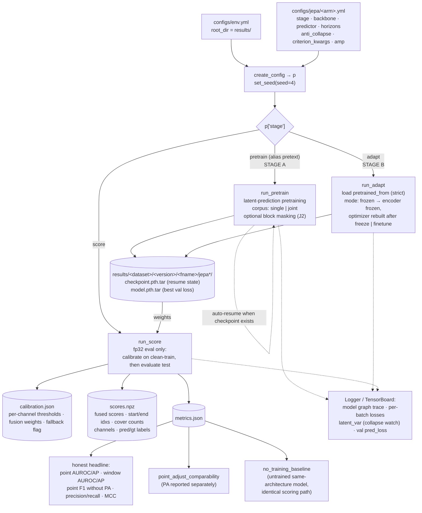
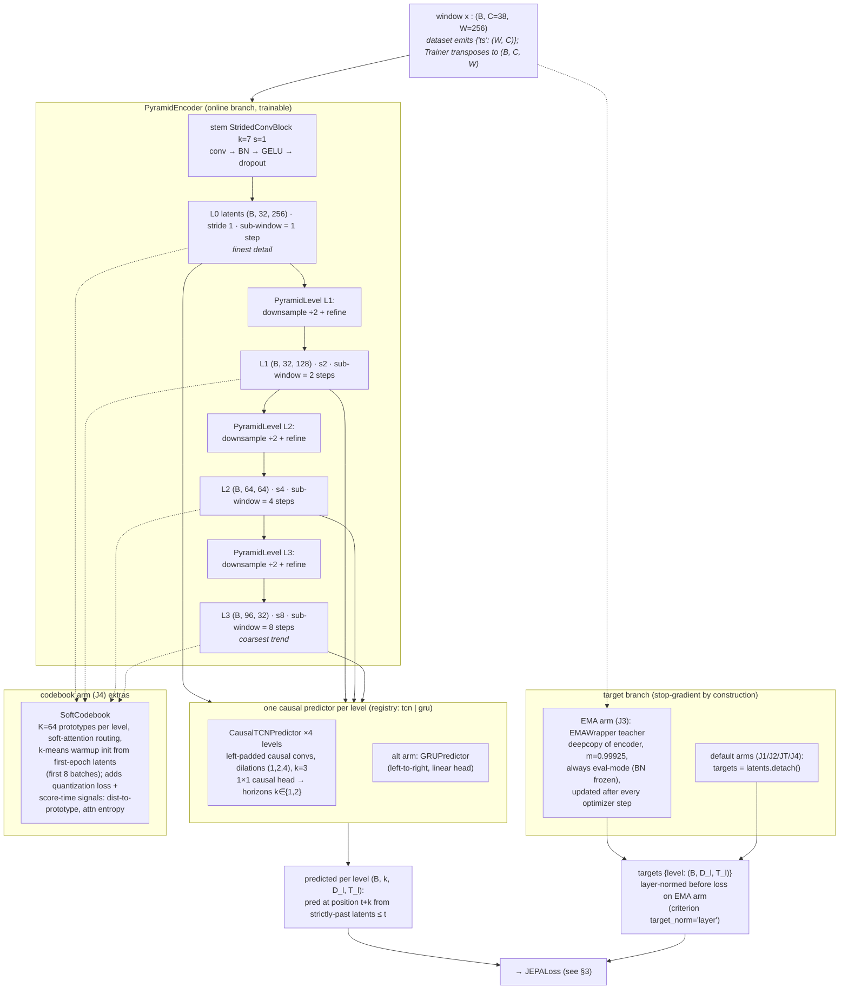
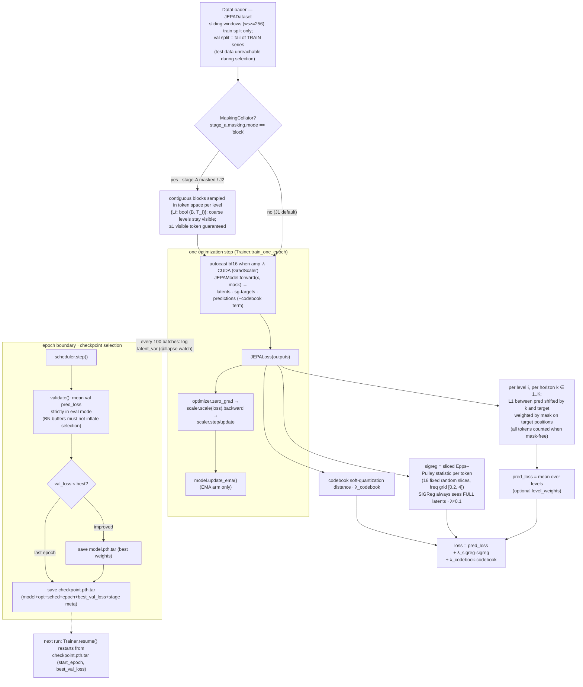
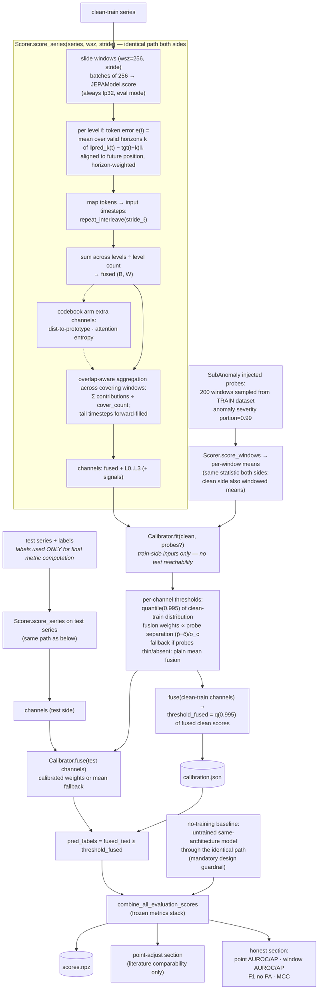

# DIAGRAM: JEPA TSAD model & training framework

Mermaid diagrams of the model and training framework as built. Companion to
`DESIGN_TSAD_JEPA.md` (spec) — drawn from code: `carla_jepa.py`,
`models/jepa_core.py`, `models/jepa_pyramid.py`, `models/ema.py`,
`models/codebook.py`, `losses/jepa_losses.py`, `losses/sigreg.py`,
`data/jepa_dataset.py`, `utils/{trainer,masking,scoring}.py`.

---

## 1. Training framework: stages, wiring, artifacts

## 2. Model: JEPAModel (facade over registries)

Wiring is registry-only via `get_jepa_model`: backbone registry
(`resnet_ts` legacy | `jepa_pyramid` | `jepa_transformer`), predictor registry
(`tcn | gru`), anti-collapse registry (`none | sigreg | ema | codebook`).

## 3. Loss and training loop (Trainer)

Frozen-adaptation details (`stage_b.mode: frozen`): encoder params
`requires_grad=False` and kept in `eval()` so BN stats never move;
EMA teacher always runs in eval mode.

## 4. Scoring and calibration pipeline (`run_score`)

---

## Component ↔ file map

| Diagram element | Code |
|---|---|
| Stage dispatch, pretrain/adapt/score drivers | `carla_jepa.py` |
| Registry wiring (backbone/predictor/anti-collapse → JEPAModel) | `utils/common_config.get_jepa_model`, `models/__init__.BACKBONE_REGISTRY`, `models/jepa_core.PREDICTOR_REGISTRY` |
| Pyramid encoder, StridedConvBlock, TCN/GRU predictors | `models/jepa_pyramid.py` |
| JEPAModel facade (encode/predict/forward/score) | `models/jepa_core.py` |
| EMA teacher | `models/ema.py` |
| Soft codebook | `models/codebook.py` |
| Dense JEPA criterion (+ mask weighting, codebook, SIGReg terms) | `losses/jepa_losses.py` |
| SIGReg (sliced Epps–Pulley) | `losses/sigreg.py` |
| Windows dataset (train-only normalization, train-tail val) | `data/jepa_dataset.py` |
| Block masking collator | `utils/masking.py` |
| Training loop (AMP, EMA update, eval-mode validation, checkpoints/resume) | `utils/trainer.py` |
| Sliding-window scorer (cover-count-aware aggregation) + Calibrator | `utils/scoring.py` |
| Frozen metrics stack | `metrics/metrics.py::combine_all_evaluation_scores` |

Arm matrix (from spec §2): **J1** plain + SIGReg (primary) · **J2** stage-A block-masked pretraining · **J3** EMA teacher · **J4** codebook · **JT** transformer encoder · corpus axis `{single (headline), joint (exploratory)}`.
