# CARLA Classification Workflow

Source: `carla_classification.py`, with model transfer in `utils/common_config.py`, dynamic neighbors in `data/custom_dataset.py`, training in `utils/train_utils.py`, losses in `losses/losses.py`, and evaluation in `utils/evaluate_utils.py`.

## Confirmed Procedure

The classification stage creates a clustering model and attempts to initialize it from a selected pretext checkpoint. It then learns from anchor, near-neighbor, and far-neighbor samples.

```mermaid
flowchart TD
    A[Read config and create classification paths] --> B[Create Logger and TensorBoard writer]
    B --> C[Build augmented train and validation datasets]
    C --> D[Build validation dataloader]
    D --> E[Build ClusteringModel]
    E --> F[Load pretext checkpoint selected by starting metric name]
    F --> G[Create DynamicNeighbors and ContrustiveDataset]
    G --> H[Create contrastive train and base dataloaders]
    H --> I[Create optimizer with optional cluster-head-only update]
    I --> J[Create classification loss and scheduler]
    J --> K[Initial model prediction over base data]
    K --> L[Initialize neighbor index arrays]
    L --> M{Classification checkpoint exists?}
    M -->|Yes| N[Load model, optimizer, scheduler, epoch, labels and best metrics]
    M -->|No| O[Start new run with normal label 0]
    N --> P{Completed model already exists?}
    P -->|Yes| Q[Load selected final model and skip training]
    P -->|No| R[Start/resume training]
    O --> R
    R --> S[For each epoch and batch]
    S --> T[Load anchor, near-neighbor and far-neighbor tensors]
    T --> U[Forward backbone plus cluster head]
    U --> V[Compute consistency, inconsistency, entropy and optional classification terms]
    V --> W[Backpropagate total_loss and optimizer step]
    W --> X{update_data enabled?}
    X -->|Yes| Y[Recompute embedding distances and neighbor indices]
    X -->|No| Z[Keep current neighbor indices]
    Y --> AA[Infer train predictions and majority/normal label]
    Z --> AA
    AA --> AB[Evaluate train and validation classification/anomaly metrics]
    AB --> AC[Scheduler step]
    AC --> AD{Logging condition met?}
    AD -->|Yes| AE[Log metrics and classification loss]
    AD -->|No| AF[Skip detailed logging]
    AE --> AG[Save best model variants and resume checkpoint]
    AF --> AG
    AG --> S
    S -->|Finished| AH[Load best model and run final train/validation evaluation]
    Q --> AH
    AH --> AI[Run per-window and reconstructed-timeseries metrics; write CSVs]
    AI --> AJ[Load classification-head best model and repeat final evaluation]
    AJ --> AK[Flush and finalize TensorBoard]
```

## Data, Transfer, and Neighbor Details

- The pretext path is constructed as `pretext_checkpoint` plus `_<metric_name>.pth.tar`; the code currently reads `starting_metric_nama` (spelled `nama`) and defaults to `loss`.
- `get_model` constructs a `ClusteringModel` whose backbone is intended to receive pretext weights. Classification training can update the whole model or only parameters whose name contains `cluster_head`.
- `DynamicNeighbors.predict_and_update` embeds original, near-augmented, and injected-anomaly windows. When `update=True`, it computes full pairwise distance matrices and stores the largest-distance near-augmentation indices and smallest-distance injected-anomaly indices.
- `ContrustiveDataset` samples one stored near and one stored far index per anchor for each training item. Thus the neighbor samples are selected dynamically at item access time, but the index arrays are only recomputed when `predict_and_update(..., update=True)` is called.
- In the epoch loop, `update_data` controls this refresh. With the shown `classification/experiments/base.yml` value `False`, neighbors are initialized once before training and are not recomputed each epoch.
- `ClassificationLoss` uses softmax output probabilities for consistency/inconsistency and entropy terms, and uses logits for its optional normal-vs-negative classification term. `total_loss` is the value backpropagated by `self_sup_classification_train`.
- Each epoch evaluates train predictions and validation predictions. It selects a majority/normal label, finds a train threshold, evaluates validation metrics with both a validation-best threshold and the train threshold, and periodically logs these values.
- Final evaluation writes CSV metrics for per-window classification/anomaly scores and reconstructed full-timeseries scores. It evaluates both `model.pth.tar` and the `_cls.pth.tar` variant.

## Normal-Set Evaluation (Tier-2 Prototype)

After the final evaluation of the best model, `normal_set_evaluation` (`carla_classification.py:471`) compares normal-class selection rules without retraining. Gated by `p.get("normal_set_eval", True)`.

- Rules: `all_majority` (current behavior, majority over anchors + weak views + synthetic anomalies), `anchor_majority` (majority over anchor predictions only), and `cov_<c>` (smallest set of classes covering fraction `c` of anchor predictions, for `c` in 0.90/0.95/0.99/1.00).
- For each rule, the anomaly score is `1 - sum_c p(c)` over the normal set and the classification decision is `argmax not in set`; train thresholds are re-derived per rule on train scores (synthetic anomalies vs rest).
- Reports window-level (`window_cls/best/train_th`) and reconstructed-timeseries (`ts_cls/best/train_th`) metrics per rule into `<classification_dir>/normal_set/<tag>eval_normal_set.csv` (long format: one row per rule x eval mode).
- `pr_evaluate` (`utils/evaluate_utils.py:561`) and `pr_evaluate_timeseries` (`utils/evaluate_utils.py:523`) accept `majority_label` as either a single int (unchanged behavior) or a list/set of normal classes.
- On machines where anchors collapse to one class, all rules coincide; divergence between rules marks multi-regime normality or anomaly/normal class confusion.

## MoCo-v2-Style Queues and Momentum Encoder (`classification_moco`)

`ClassificationLossMoCo` (`losses/losses.py:491`, registered as criterion `classification_moco` in `utils/common_config.py`) extends `ClassificationLoss` with two FIFO queues of detached softmax probabilities (MoCo-v2 principle: decouple negatives from batch size, keep them consistent with a momentum encoder). With `queue_topk < 0` and `queue_anchor: False` the objective is numerically identical to `ClassificationLoss`.

Loss kwargs (`criterion_kwargs`):

- `queue_size` (default 8192): capacity of each queue.
- `queue_topk` (default 32): `> 0` keeps the top-k hardest (most anchor-similar) queued negatives per anchor for the queue inconsistency term; `0` uses the full queue; `< 0` disables the queue inconsistency term.
- `queue_warmup` (default 0): minimum queued entries before any queue term activates.
- `queue_anchor` (default True): estimate the loss's normal class from the mean of the anchor queue instead of the per-batch argmax, stabilizing the classification target across batches.

Training-loop flags (top-level config keys, read with defaults in `carla_classification.py`):

- `ema_momentum` (default 0.999): EMA coefficient for the momentum encoder. The encoder is built after checkpoint loading (`copy.deepcopy`, `requires_grad_(False)`, eval mode) whenever `ema_negatives` or `ema_mining_every > 0` is set, and is updated after every optimizer step (`update_ema_model`, `utils/train_utils.py:9`; parameters are EMA-updated, buffers such as BatchNorm running stats are copied).
- `ema_negatives` (default False): `False` keeps the current negative branch (live model in `eval()` mode, so the loss graph of the negatives is kept and the model learns to process them); `True` forwards negatives through the EMA encoder under `no_grad` (consistent negatives, but no gradient learning on the negative branch).
- `ema_mining_every` (default 0): if `> 0`, re-mines the neighbor index arrays with the EMA encoder every k epochs (`predict_and_update(model_ema, ..., update=True)`), refreshing the stale mined pairs without the distribution shock of re-mining with the live model. Metrics in the same epoch still come from the live model, and the live model's `predict_and_update` runs after the EMA pass, so `classification_trainprobs.csv` keeps live-model content.

Queues store detached probabilities only, are created lazily on first forward, and are transient (`persistent=False` — not saved in checkpoints; they refill within a few steps after a resume). Queue diagnostics (`queue_inconsistency`, `queue_filled`, `normal_class_idx`) are logged with the other loss meters. The queue slice used in the loss is cloned before use so the in-place FIFO update cannot invalidate the autograd graph.

Example configs: `configs/classification/experiments/moco.yml` (eval-mode negatives + queue + EMA re-mining) and `configs/classification/experiments/moco_ema.yml` (EMA negatives).

## Follow-up TODO List

- [ ] **Python/runtime syntax validation:** keep `python -m py_compile carla_classification.py carla_pretext.py` in CI. The scripts contain dense nested f-strings and should be checked on the supported Python versions.
- [ ] **Pretext transfer loading:** verify `utils/common_config.py:74-93` with an actual pretext state dict. A `ClusteringModel` has missing `cluster_head.*` keys and unexpected `contrastive_head.*` keys, while the assertion checks for missing `contrastive_head.*`; this appears reversed and may reject valid transfer loading.
- [ ] **Metric-name typo:** verify whether `starting_metric_nama` in `carla_classification.py:72` is intentional. If configuration uses the natural spelling `starting_metric_name`, it is ignored and the `loss` checkpoint is always selected.
- [ ] **Neighbor refresh after resume:** after loading a classification checkpoint, verify whether neighbors should be recomputed using the resumed model. The initial neighbor prediction occurs before checkpoint loading, and `update_data: false` preserves that stale graph.
- [ ] **Neighbor semantics:** confirm the intended direction in `DynamicNeighbors:160-174`. “Furthest near-neighbors” are selected from the near-augmentation distance matrix using largest distance, while “nearest far-neighbors” are selected from the anomaly distance matrix using smallest distance. This may be deliberate difficulty mining, but the names and stated near/far objective should agree.
- [ ] **Pairwise-distance memory:** benchmark `torch.cdist` over the complete training set twice per refresh. This is O(N^2) memory/time and can dominate classification runs.
- [ ] **PR threshold indexing:** test `utils/evaluate_utils.py:544-551` when the best F1 is at the final precision-recall point. `precision_recall_curve` returns one fewer threshold than precision/recall values, so `thresholds[best_f1_index]` can be out of bounds.
- [ ] **Final model availability:** test a fresh run, an interrupted run, and `epochs=0`. The unconditional final loads at `carla_classification.py:278` and `:284` require both saved model variants to exist.
- [ ] **Train checkpoint overwrite:** verify the two saves at `carla_classification.py:238-252`. The train-best-F1 and train-threshold validation conditions both write the same `*_train.pth.tar`, so the later condition can overwrite the model selected by the earlier metric.
- [ ] **Timeseries reconstruction assumptions:** test variable window lengths, gaps, and an empty prediction set. `pr_evaluate_timeseries` repeats predictions using the first window length, while `model_evaluation` sizes the output from `end[-1]`.
- [ ] **TensorBoard growth:** profile `GradientMonitor` histograms/figures, graph logging, and final evaluation figures. Classification logging is enabled without the pretext logger's cleanup flag, so event files can grow substantially; this is a likely contributor to very large runs, although model weights are saved separately as `.pth.tar` files.
- [ ] **Loss device/scalar handling:** exercise `ClassificationLoss` with CUDA and with `entropy_norm=True`. Several scalar tensors are created with `torch.tensor(...)` without the active device, and the class-count tensors are also used in shape/math expressions.
- [ ] **Validation leakage policy:** document whether selecting thresholds and model variants using validation labels is intended for the reported experiment protocol.
- [ ] **MoCo queue resume behavior:** queues are transient by design and refill within a few steps after resume; verify `queue_warmup` gating prevents a loss-term jump on resumed runs.
- [ ] **EMA re-mine cost:** with `ema_mining_every > 0`, re-mine epochs run two full train-set passes (EMA re-mine + live metrics pass), each with 3 forward passes; profile against run time.
- [ ] **Anchor-queue vs epoch-level normal label:** the loss's queue-based `normal_class_idx` and the epoch-level `normal_label` from `predict_and_update` can diverge; log both and check for flips before comparing machines.

## Reference Locations

- Entry point and epoch control: `carla_classification.py:42-340`
- Final evaluation: `carla_classification.py:372-469`
- Normal-set evaluation: `carla_classification.py:471-593`
- EMA encoder construction and re-mining: `carla_classification.py:174-190`, `carla_classification.py:215-222`
- Model transfer: `utils/common_config.py:46-106`
- Dynamic neighbor mining: `data/custom_dataset.py:96-218`
- Contrastive sampling: `data/custom_dataset.py:220-261`
- Training step: `utils/train_utils.py:81-176`
- EMA update: `utils/train_utils.py:9-20`
- Classification loss: `losses/losses.py:294-488`
- MoCo queue loss: `losses/losses.py:491-755`
- Metrics and thresholding: `utils/evaluate_utils.py:523-600`

## Focused Agent Review

The classification flow was reviewed by separate agents for orchestration/checkpoints, pretext transfer, dataset/neighbor mining, training mechanics, loss math, prediction/evaluation, and output logging. No agent edited files during the review.

### Decisions

- Different pretext/classification backbone configurations are treated as separate experiments, so architecture mismatch was not changed here.
- Neighbor mining before classification checkpoint restoration is retained as intentional difficulty transfer from the pretext model. `update_data` now defaults to `False` when omitted, allowing one-time initialization without a configuration `KeyError`.
- The inferred normal label includes synthetic views by design because real anomalies are unavailable in the training set.
- Validation threshold/model selection remains accepted as a validation/tuning protocol.
- R-AUC/VUS hard-label semantics and loss `shift_weight` behavior are deferred for a later review.

### Applied Fixes

- Classification checkpoints now save and restore `next_epoch`, preventing a completed epoch from being repeated.
- Completion checks use `start_epoch >= epochs`.
- Cluster-head-only forward passes now return the dictionaries required by both classification losses; the frozen backbone remains in evaluation mode.
- Train-best-F1 and train-threshold model artifacts now use separate paths.
- Inference prefers the selected validation-best `model.pth.tar` over the latest resume checkpoint and now produces hard predictions correctly.
- Classification gradient logging disables per-batch histograms and aggregates gradient norm/update-ratio scalars over each epoch. Gradient-flow figures are disabled in aggregate mode.
- Final classification timeseries figures are disabled by default and can be enabled with `classification_make_figures`.

### Timeseries Evaluation Findings To Review Later

- `metrics/metrics.py:95-108` assumes at least two windows and uses fixed overlap normalization based on the first two starts.
- `utils/evaluate_utils.py:510-515` repeats each window decision across a fixed first-window length, so this is window-level voting rather than point-level anomaly scoring.
- Event boundary handling and point-adjustment behavior should be tested against half-open event intervals.
- All-normal and empty-prediction cases can fail in affiliation/confusion-matrix metrics.
- `pr_evaluate()` indexes a threshold array that is one element shorter than precision/recall in some edge cases.
