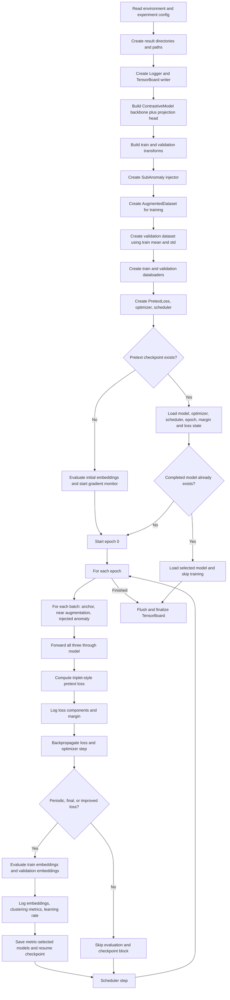

> **HISTORICAL RECORD.** The contrastive pretext pipeline described here was
> deleted at the JEPA cutover (see `specs/jepa-tsad-rebuild.md`, ticket 12).
> Kept for provenance of the earlier experiments; nothing in this document
> applies to the current `carla_jepa.py` pipeline.

# CARLA Pretext Workflow

Source: `carla_pretext.py`, with the training/loss path in `utils/train_utils.py`, `utils/common_config.py`, `data/custom_dataset.py`, and `losses/losses.py`.

## Confirmed Procedure

The pretext stage builds a representation model before classification. It does not load a previous model unless a pretext checkpoint exists.

## Data and Loss Details

- `get_train_dataset(..., to_augmented_dataset=True)` wraps the source windows in `AugmentedDataset`.
- Each training item contains `ts_org`, `ts_w_augment`, and `ts_ss_augment`. The latter is generated by `SubAnomaly`; the near augmentation may be a preceding window or a transform.
- The training loop forwards the three views, concatenates their outputs, and passes them to `PretextLoss`.
- `PretextLoss` splits the batch into anchor, positive, and negative groups, optionally crops and normalizes feature sequences, computes similarity distances, applies margin/clamping/reweighting, and returns `loss`, distance diagnostics, and `clear_loss`.
- Only `losses["loss"]` is backpropagated. The other values are monitoring/checkpoint metrics.
- Evaluation uses `contrastive_evaluate`: it embeds the anchor/near/far views, runs two-cluster MiniBatch K-means, and records Silhouette, Calinski-Harabasz, and Davies-Bouldin scores.
- The validation dataset uses the training dataset's mean and standard deviation, so validation normalization is tied to training statistics.
- Training evaluation is triggered every 200 epochs, on the final epoch, or whenever the current loss improves over the tracked best loss.
- `make_checkpoint` writes `model.pth.tar` whenever a tracked metric improves and writes a metric-named resume checkpoint. The regular resume checkpoint is also written inside the evaluation block.

## Independent Review

The following review was performed after tracing the complete pretext flow. These findings are code-level risks; good clustering metrics do not rule out the checkpoint and data-pipeline issues.

The user-approved fixes have now been applied to `carla_pretext.py` and `data/custom_dataset.py`: checkpoint metric directions, generic model ownership, resume metadata/epoch handling, scheduler checkpoint state, and normalized training views. Crop/config compatibility, device handling, train/eval mode, and evaluation semantics were intentionally not changed.

- **Fixed:** `make_checkpoint` now maximizes Calinski-Harabasz/Silhouette and minimizes Davies-Bouldin. The initial best-value sentinels and all metric calls were corrected.
- **Fixed:** `model.pth.tar` is now owned only by the loss-best checkpoint; metric-specific files remain separate.
- **Fixed:** resume checkpoints now store all best-metric values and `next_epoch`; scheduler state is serialized after advancing to the next epoch. Old checkpoints fall back to `epoch + 1`.
- **Confirmed, high and configuration-dependent:** `PretextLoss` calls `self.random_crop(...)` when `crop=True`, but `PretextLoss` has no `random_crop` method (`losses/losses.py:573-581`). Configurations that omit `crop` use the default `True` and fail on the first batch. Configurations setting `crop: False` avoid this path.
- **Confirmed, high and configuration-dependent:** `get_criterion` recognizes `pretext`, `classification`, `classification_e2e`, and `tcl`, but not `pretext_new` (`utils/common_config.py:10-30`). The `new_loss` configurations using `criterion: pretext_new` cannot be loaded by the current factory. Several older `pretext` configurations also pass unsupported `criterion_kwargs` such as `margin_constant`, `orig_margin`, and `hard_neg`.
- **Confirmed, high:** training scaling is computed but discarded. `AugmentedDataset` stores scaled arrays in `self.ts_org`, `self.ts_w_augment`, and `self.ts_ss_augment` (`data/custom_dataset.py:68-70`), but stores raw arrays in `self.samples` (`:74-80`) and returns those raw samples (`:93-94`). Meanwhile SMD validation data is standardized in `data/SMD.py:54-57`. Unless another wrapper changes this, train and validation embeddings use different scales.
- **Confirmed, medium-high:** validation does not contain the three views used by training. `contrastive_evaluate` evaluates all available view keys (`utils/evaluate_utils.py:263-285`), but the validation dataset is plain SMD (`carla_pretext.py:62-64`) and therefore supplies only `ts_org`; train evaluation is a three-view mixture while validation evaluation is original windows only.
- **Confirmed, medium-high:** the usual “near augmentation” is usually a preceding raw window, not the configured noise transform. For indexes greater than 10, `AugmentedDataset` selects a previous raw sample (`data/custom_dataset.py:59-63`); the transform is used only for the first samples, and the stored samples remain raw.
- **Confirmed, medium:** the three forwards do not share the same mode. Anchor and near views run in training mode, then the negative view runs in evaluation mode (`utils/train_utils.py:35-39`). Dropout and BatchNorm behavior therefore differs for the negative branch.
- **Confirmed, medium:** CPU execution is not reliably supported. The script selects CPU when CUDA is unavailable (`carla_pretext.py:41`), but the default `PretextLoss` creates its state on `cuda` (`losses/losses.py:498-530`) unless the config explicitly overrides the device.
- **Confirmed, configuration-specific:** `carla_pretext_smd_threeB_twoC.yml` declares three `mid_channels` blocks but only two kernel sizes; `ResNetRepresentation` creates one block per channel entry and each block indexes its kernel list (`models/resent_time.py:116-129`). Model construction should fail for that configuration.

## Follow-up TODO List

- [x] **Checkpoint metric directions:** corrected and checked with synthetic metric values.
- [x] **Generic model definition:** `model.pth.tar` is explicitly loss-best; metric-specific files remain available.
- [x] **Resume state:** all best metrics and `next_epoch` are persisted; scheduler state is saved for the next epoch.
- [ ] **Legacy scheduler state:** old checkpoints without `next_epoch` resume at `epoch + 1`, but their scheduler was serialized before the old scheduler step. Verify legacy-run learning rates or restart those runs with the new checkpoint format.
- [ ] **Checkpoint cadence:** verify whether saving the resume checkpoint only inside the evaluation/improved-loss block is acceptable. If no trigger occurs for a long interval, progress is not checkpointed.
- [ ] **Configuration compatibility:** enumerate all pretext YAML files and validate `criterion` names and `criterion_kwargs` against the current factory and loss signatures.
- [ ] **Crop implementation:** either confirm all production configs set `crop: False` or test/repair the missing `PretextLoss.random_crop` path.
- [x] **Train/validation scaling:** `AugmentedDataset.__getitem__` now returns the scaler-normalized views used by training.
- [ ] **Evaluation comparability:** decide whether validation should also contain the three views or whether train evaluation should evaluate only original windows.
- [ ] **View semantics:** measure how often `ts_w_augment` is a preceding raw window versus a transformed copy and confirm that this is the intended positive construction.
- [ ] **Train/eval mode:** test whether the negative branch should run in training mode like the other two views, especially with BatchNorm and dropout enabled.
- [ ] **CPU path:** run a minimal CPU configuration and verify every criterion/similarity-loss tensor is created on the selected runtime device.
- [ ] **Backbone config validation:** instantiate every pretext model config and ensure `len(kernel_sizes)` is compatible with `mid_channels`.
- [ ] **Empty-mask diagnostics:** test `PretextLoss` when every sample is active or inactive. The implementation handles empty masks for some terms, but the resulting reported component values and checkpoint comparisons should be checked for finite values.
- [ ] **Crop bounds:** test `crop_size_min`, `crop_size_max`, and window length combinations. `np.random.randint(min, max)` excludes the maximum and fails when the selected range is invalid.
- [ ] **Evaluation memory:** benchmark `SilhouetteScore` and embedding logging for the full dataset. Pairwise distances are O(N^2), and `add_embedding` is repeated at evaluation points.
- [ ] **Reproducibility:** check CUDA determinism and DataLoader randomness across workers. The seed is set globally, but worker-specific seeds are not configured.

## Reference Locations

- Entry point and epoch control: `carla_pretext.py:39-232`
- Dataset construction: `utils/common_config.py:116-173`
- Augmented samples: `data/custom_dataset.py:15-94`
- Training step: `utils/train_utils.py:7-65`
- Loss: `losses/losses.py:491-689`
- Embedding evaluation: `utils/evaluate_utils.py:254-334`
